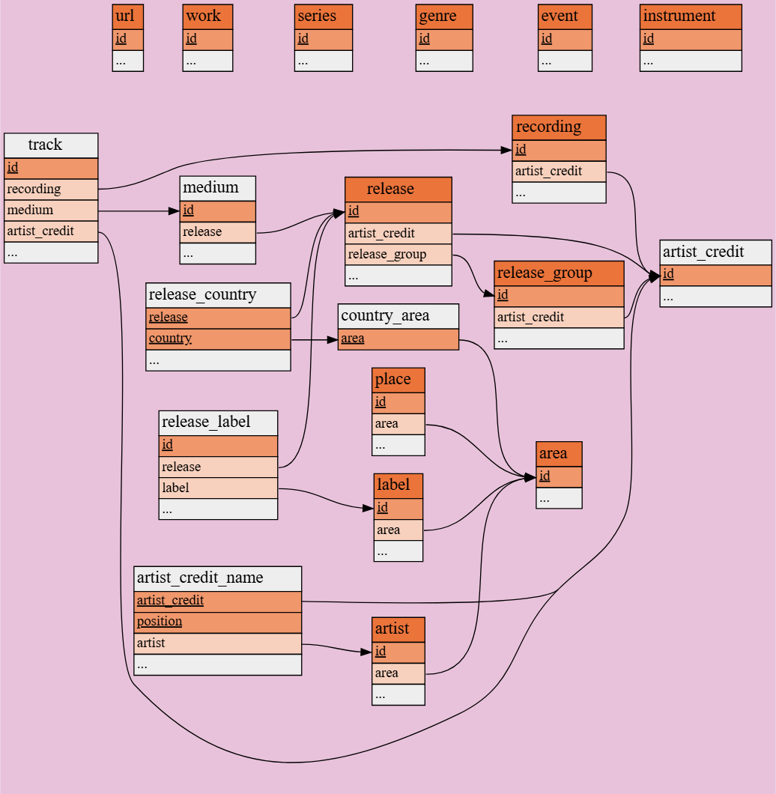
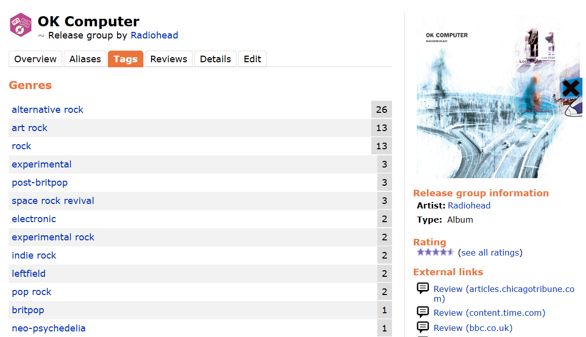
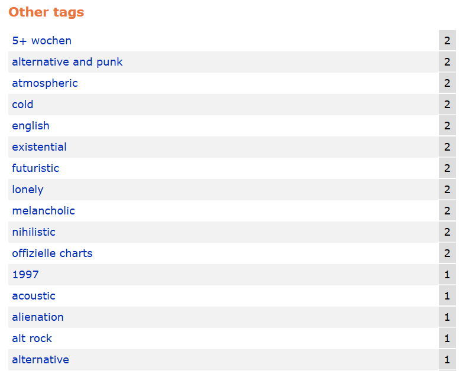

# mb tool

This app serves as an exploratory tool into a cleaned up and simplified snapshot of the [MusicBrainz open-source postgreSQL database](https://musicbrainz.org/doc/MusicBrainz_Database), with the database snapshot taken in roughly March of 2025. I created the database in 2025 intending to use it for a now defunct music discovery app (music toy). That app was a good learning experience, but ultimately was not very useful due to the limitations of the database, and I abandoned it. This app is another take on the same idea, but far simpler while leaning into said limitations to make the most out of them.

The app utilizes the [Vanna RAG Framework](https://vanna.ai) with ollama's `qwen2.5-coder:14b` model for SQL generation, and the [chainlit LLM chatbot UI](https://chainlit.io) with some style tweaks.

## MusicBrainz?
What MusicBrainz purports to be is a complete database of objective musical metadata. *Complete* is the key word: it is literally all released music, including international rereleases, deluxe editions, compilations, singles, bootleg live albums, audiobooks, spoken word...it goes on. It is a fascinating piece of work, founded all the way back in 2000. Totally free, open-source, lenient API access, everything that makes a passion project from the oughts really cool.

This database is **Dense**. Here's the simplest, highest possible level schema [from their docs:](https://musicbrainz.org/doc/MusicBrainz_Database/Schema)



If you go to the schema page you can see a ton of other schema visuals and more complete descriptions of the tables. 

MusicBrainz, while extremely cool, has essentially no useful or intuitive way to really *dig* into the vast, layered abyss that is (theoretically) all music ever publically recognized.  

For the purposes of this app, I took a complete snapshot and pruned it aggressively down to very surface-level metadata: artist, track, album, release year, release type, track duration, and the great and terrible tags arrays which pulls the whole thing together, and that I will cover later.

## Functionality

By itself, the database isn't all that useful unless I want to list some discographies or perhaps marvel at the [123 distinct releases of *The Dark Side of the Moon*.](https://musicbrainz.org/release-group/f5093c06-23e3-404f-aeaa-40f72885ee3a) Enter ollama. At first, I had intended for the model to be trained on purely statistical data interpretations, i.e. something like *`when approximately did Disco die?`* or tracking release trends over time. While the model is trained to answer very simple statistical questions, I ultimately decided to go heavy into discovery being the main function. 

## How it works
The main function of the app revolves around three output types: `track`, `album`, and `artist`. The main loop is as follows:

1. The user asks the chatbot for either one of the three types of output (a *Discovery* query) plus search criteria, or a question about the literal database information (a *Statistical* query)
2. The model translates the user's request into a SQL query trained on the shape of the database schema
3. Results are returned based on the type of query:
    - **Discovery**: Results are randomized within the query, limited to the number requested by the user (10 by default), and returned.

    - **Statistical**: Returns the raw table output of the query for simplicity.

### Database
Three main tables, plus relevant filter columns: 
- `track`: individual recordings, or "songs". `recording` from the MB schema. 
    - `track.duration`: in milliseconds. A deceptively powerful column that allows for fun queries like long songs or average track/album length.

    - `track.position`: the track's position on its respective release. Can be used for full tracklist displays or very niche queries involving track position.

    - `track.title_search`: normalized (punctuation and spaces removed) track title. Originally, this column was meant for live search and indexing in a different project, but here we can use it to return results with certain substrings. 

- `album`: the "canonical" release, meaning the original release of a given album. Therefore, there is a single row per unique album. `release_group` from the MB schema. 
    - `album.release_year`: the central crux of all queries having to do with decades in music or just general time period filtering

    - `album.release_type`: every album has a type. The basic type is `Album`, or just a standard studio album. Other important types include `Live`, `Compilation`, `EP`, `Remix`, `Demo`. 

    - `album.duration`: same idea as with tracks, but calculated and given a dedicated column for simplicity.

    - `album.title_search`: normalized title, same as with tracks.

- `artist`: the "canonical" artist name.
    - `artist.nationality`: artist's country of origin. Importantly, this does not guarantee music in a certain language (but that's coming soon!), just the country the artist is from.

    - `artist.name_search`: normalized name, same as with albums and tracks.

Two auxiliary, fanned-out tables:
- `album_variations`: this is where the 123 different The Dark Side of the Moon versions come from. All known variations of a given release, all rolling up into `album`. `release` from the MB schema, and required to link a `track` directly to its respective `album`.

- `artist_credit`: an interesting table comprising of all the combinations of `artist` that can be tied to an `album` OR a `track`. For example, the song "Under Pressure" by Queen featuring David Bowie. Rolls up into `artist`, meaning the final row will list Queen as the sole canonical artist.


And one utility table purely to aid discovery:
- `similar_artist`: a many (similar artist id) to one (artist id) join table, created using the [ListenBrainz similar-artists API](https://labs.api.listenbrainz.org/similar-artists).
    - [ListenBrainz](https://listenbrainz.org) is, more or less, a worse last.fm. It is a free public logging tool for your music listening over time, allowing to track your listening trends. 

    - The similar-artist API uses their algorithms to, given an input artist, find a list of up to 100 "similar" artists based on user listening data. Essentially, the artists that listeners of the given artist *also* listen to most frequently.

### Tags
A double-edged sword.

*Skip to **querying tags** for actual usage.*

On the MB website, all tracks, albums and artists have a section for tags. These tags *generally* tend to be musical genres or sub genres:



The numbers on each row represent upvotes by the community. Here we can see `alternative rock`, `art rock`, and `rock` as the top three which make sense and are upvoted accordingly. 

The tags can be submitted by anyone, and while they do go through a review process (which I have some serious questions about, see below), there is still a bunch of junk:



Something in German, the release year, a million variations on alternative rock, and some vaguely descriptive tags. The descriptive tags would be welcome for a tool like this, but there are not nearly enough of them on the vast majority of entries to be useful; this album is an outlier because it's so popular.

It doesn't seem like a huge deal on the surface, but with some python I was able to peek under the hood to see just how bad things really get. What follows is a random excerpt from the middle of an array of every single unique album tag in the snapshot:

```
...'antima music', 'echoes of hope', 'extended mix', 'italy', 'jukka', 'original mix', 'radio edit', 'rafal golda', 'rafał gołda', 'spirituals', '2000s', 'breton', 'lithuanian downtempo', 'town on cover', 'lyric video', 'dosei'...
```

And just for fun, here's an excerpt from the track tags:

```
...gta', 'classic r&b/soul', '6417b5c9-495d-4b87-9488-e692947251e9', '(year.length>0 ? year.substring(0', 'classic rock; blues rock; british invasion; psychedelic', 'pop_13 pop', 'ambient; big beat; electronic; jazz; pop', 'techno minimal', 'teen girl group', '14 r b_r b', 'rock_17 rock', '17 rock_rock', 'pop_britpop_britpop_pop_britpop_pop', 'country grammer', 'st louis', 'nellyville'...
```

Truly bizarre. So, I decided to clean all of it up. 

I first collected every unique tag in the database into an array in a text file, one file for albums, artists, and tracks. I then set up a connection to OpenAI's API to automate the actual cleaning because, as you can imagine, there were many *tens of thousands* of strings to look through. 

I wrote instructions to essentially prune all strings from the given array that had nothing to do with music genres. As this was early 2025, the flagship LLMs were good but not quite as powerful as they are today, so I had it work with small batches of strings over many hours to avoid context window problems with output quality. 

The result was three reduced and cleaned genre tag arrays. Not perfect, but vastly improved over the raw tag data. Finally, I took each of these tag arrays and ran them against each row of their respective tables. For each row, all tags in the array that did not appear in the master array were removed.

The final product is the `cleaned_tags` array column on each of the main three tables, which hold, for the most part, genre and sub genre information for artists, tracks, and albums. 


### Querying tags
Rows on `album`, `artist`, and `track`** have arrays of tags that display genre and sub genres which allow for powerful genre-based discovery queries.

For example, here are the tags for Steely Dan's *Gaucho*:

```
blue-eyed soul, classic rock, fusion, jazz, jazz pop, jazz rock, pop, pop rock, rock, smooth jazz, soft rock, sophisticated rock, yacht rock
```

So, when querying for `soft rock` albums or any of the genres in the list, you have a chance at seeing this album come up (it's really good listen to it).

The model is trained to differentiate between a "broad" and a "sub" genre and will make the query more or less strict depending on that decision. So, using the same example above, you can see there is not only `rock`, but several sub genres like `classic rock` and `yacht rock`. **The model includes ALL sub genres underneath a broad genre.** 

What this means is if you ask for `rock` albums, you can receive results that are tagged `hard rock` OR `soft rock` OR `indie rock` etc, and because of this results that do not have the single `rock` tag at all can also be returned. This kind of fuzzy result is very intentional for music discovery. 

On the other hand, **sub genres are matched exactly.** Searching for `smooth jazz` will not inherently return other types of jazz, unless the result also happens to have another jazz tag. Searching for a sub genre guarantees that it will appear at least once.

** *For simplicity and consistency, all track queries actually use the more comprehensive **album tags** when searching based on genre, rather than track-level tags. This is explained more in the **Limitations** section.*


## Putting it all together

Let's take a look at a very simple query:

*`Show me one 80s prog rock album`*

Gives us:

```
SELECT

album.gid,
artist.name AS artist_name,
album.title AS album_title,
album.release_year AS released,
to_char((album.duration || ' milliseconds')::interval, 'HH24:MI:SS') AS duration,
album.cleaned_tags AS tags

FROM album

JOIN artist_credit ac
ON album.artist_credit = ac.id

JOIN artist
ON ac.artist_id = artist.id

WHERE album.cleaned_tags IS NOT NULL
AND artist.name NOT IN ('Various Artists', '[unknown]')
AND album.release_type = array['Album']
AND album.cleaned_tags && array['progressive rock']
AND album.release_year BETWEEN 1980 AND 1989
ORDER BY RANDOM()
LIMIT 1;
```

We grab:

- `album.gid` to generate album art from MB's album art API

- `artist.name`, `album.title`, `album.release_year`, `album.duration` self-explanatory

- `album.cleaned_tags` genre tags

The `WHERE` clause has a few standard shapes which do heavy lifting to remove noise from results:

- `album.cleaned_tags IS NOT NULL` we **ALWAYS** return rows that have at least one tag, no matter what. 

    - This cuts the total number of valid album rows to just under half (~1.4m tagged from ~3.6m total) but remains a substantial number. Millions of rows in the database are for music or performances that cannot possibly be found online to listen to because anyone can add anything to the database. So, we do as much as we can to remove junk rows. 

    - This filter also allows us to return single tracks that are **not** tagged from albums that **are**, actually increasing the number of possible track results for a given query.

- `artist.name NOT IN ('Various Artists', '[unknown]')` removes more junk, but technically also cuts real compilations that have many artists. I decided this tradeoff is worth it.

- `album.release_type = array['Album']` release type data is a bit odd in that a studio album is guaranteed to have exactly a release type of `['Album']`, while a live album could have either `['Live']` OR `['Live', 'Album']` and many other combinations. Same for the other release types as well. Therefore we force an exact release type for studio albums, and the contains `@>` operator for everything else.

- `album.cleaned_tags && array['progressive rock']` since `progressive rock` is a *sub* genre, we use overlap to return results containing the exact tag.

    - For *broad* genres, we would instead use an unnest statement combined with LIKE: `EXISTS (SELECT 1 FROM unnest(album.cleaned_tags) t WHERE t LIKE '%folk%')`

- Various other criteria filters are applied here depending on the query, such as `artist.nationality`, `album.duration` and other columns described above. 

- `ORDER BY RANDOM()` roughly get something different every time

I ran this while writing and got an album named *Troll, Vol. 2*. Weird stuff. 

## Limitations and problems

### Too much data
Anyone can edit MusicBrainz and add data, and while there is something of a review and voting process according to the docs, it isn't perfect. Everything from straight duplicates to erroneous release editions to local musicians a guy saw live once and who were never heard from again are in there. While the freedom to update and edit for the purposes of the complete database is definitely a good thing, it makes things pretty messy when you want to grab assorted random selections as this app attempts to do. Not to mention the tagging disaster covered earlier.

Speaking of tags, while the majority of rows lack tags altogether, a significant number of the most popular music almost has *too many* tags. The Beatles, while an extreme example, illustrates this with their collection of genres:

```
adult alternative pop rock, art pop, art rock, baroque pop, beat, beat music, blues rock, british invasion, british psychedelia, british rhythm & blues, britpop, classical pop, classic pop and rock, classic rock, europop, experimental, experimental rock, film soundtrack, folk pop, folk rock, folk-rock, garage, hair metal, hard rock, heavy metal, indie rock, instrumental pop, mainstream rock, merseybeat, orchestral, orchestral pop, pop, pop-metal, pop rock, pop-rock, progressive rock, psychedelia, psychedelic, psychedelic pop, psychedelic rock, rhythm & blues, rock, rock and roll, rock & roll, rock roll, singer songwriter, sunshine pop
```

Is all of this technically true? Sure...hair metal? what? because of helter skelter? The result though is that when you *are* looking for some neat new hair metal bands (or art pop or signer songwriter or folk or...), you might get a visit from everyone's favorite boys.

Through data cleaning and strict filtering rules, we can fairly consistently get results that are pretty good; "good" in this case meaning easy to find and listen to, and roughly the correct genre(s). 

### Not enough data
Millions of rows are missing data the excludes them entirely from being discovered by this app. Primarily tags of course which are the main problem, but also smaller things that can be useful like artist nationality, even song duration doesn't exist if nobody ever adds it. The data can still be useful for statistical queries, but for discovery there is simply no point in displaying an album title and artist with no other identifying information, so we don't.

### Subjective querying
Back to tags again. As discussed, tags lean objective. Genre, sub genre. There are exceptions, but for all but the most popular music there is nothing in the way of musical qualities: ethereal, upbeat, melancholy, noisy...tags you can very easily find on a website like [Rate Your Music](https://rateyourmusic.com). These things don't exist in the database and currently I don't know of a feasible way to make that happen. Maybe if RYM ever gets their API online...


